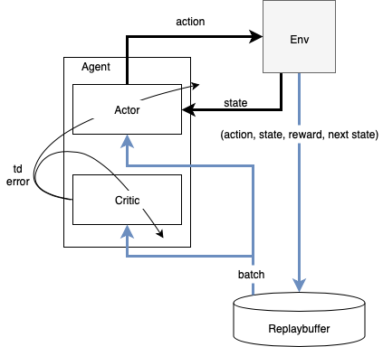
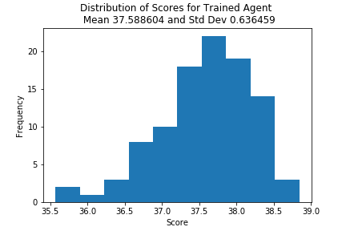

# Report 

## Baseline Evaluation
To evaluate the performance of the agent we performed a baseline test at the beginning of the project and run the environment N=100 times with random uniformly distributed actions. Below diagram shows the distribution with its mean and standard deviation from this experiment.

## Learning Algorithm

We utilized a deep deterministic policy gradient learning method for solving this project. Lucid detailed descriptions of the algorithm can be found [here](https://spinningup.openai.com/en/latest/algorithms/ddpg.html) and [here](https://arxiv.org/pdf/1509.02971.pdf). Key idea is that an agent constitutes of two concurrent networks that are trained to achieve the goal: The critic network takes as input the state vector and the action vector and approximates the total expected reward. The actor takes as input the state vector and approximates the policy. Training is realized through TD-learning of actors and critics from batches of random samples of a replay buffer that is continuously updated with the latest training samples. The actors performance is evaluation by using the critic network.

The following robustifications were added in order to achieve the project goal:
 - adding batch normalizations in both actor and critic network
 - prefilling the replay buffer before learning with 10 episodes
 - Introduction of two additional hyperparameters to control learning: The agent updated the net only every LEARN_EVERY = 20 steps and then did an update with samples of the replay buffer LEARN_TIMES = 10 times

### Actor Network Architecture
The actor network is a fully connected network with input layer the state size 33 then followed bz two layers of size 100 each and then followed by the output layer of the action space size. The input layer and the hidden layers are followed by a batch normalization and a relu-function, the output layer is mapped to the valid action range by a tanh-function.

The full network architecture details are vizualized below with an assumed batch size of 256:

### Critic Network Architecture
The critic network is a fully connected network with two input layers: The first input layer takes the state vector to a fully connected layer with 100 nodes followed by a batch normalization and a relu-function. The result is concatenated with the action vector and forms the input to a fully connected layer with 100 nodes. This layer is followed by a relu function 

The full network architecture details are vizualized below with an assumed batch size of 256:

### Hyperparameters

| Hyperparameter       | Value   |
|----------------------|---------|
| BUFFER_SIZE          | 1000000 |
| BATCH_SIZE           | 256     | 
| GAMMA                | 0.99    |       
| TAU                  | 1e-3    |         
| Learning Rate Actor  | 1e-3    |     
| Learning Rate Critic | 1e-3    |    
| WEIGHT_DECAY         | 0.0     | 
| EPSILON_START        | 1.0     |
| EPSILON_DECAY        | 0.9995  |
| EPSILON_END          | 0.00001 |
| LEARN_EVERY          | 20      |
| LEARN_TIMES          | 10      |
| PRIO_ALPHA           | 0.1     |

## Results

We trained the algorithm until an elevated threshold for the moving average score (dark blue line) of 35 was reached after approx. 183 episodes. The original threshold of 30 was exceeded after 143 training episodes. For the sake of interest the graph also shows the mean score per episode take over all 20 robot arms (light blue line) as well as the maximum and minumum scores from indiviual agents (blue shaded area). Interestingly the maximal scores are not exceeding a threshold of 40 although the theoretical optimal score is Timessteps * pos. reward = 1000 * 0.1 = 100.

With the trained agent we performed the baseline experiment of 100 episodes again. The results are shown below.

## Ideas on Future Work and Possible Improvements

 - Implementation of prioritized replay to improve the learning performance (ongoing)
 - Variation of hyperparameters and network architecture to improve learning and action performances
 - Distributed learning (A3C)
