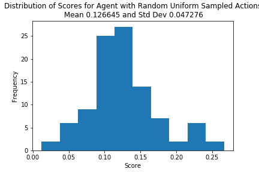
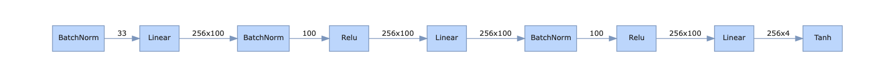
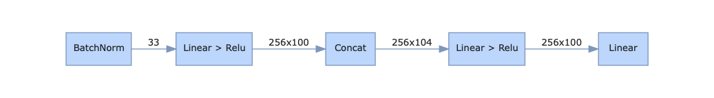
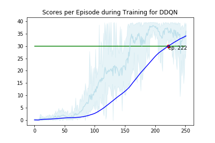

# Report 

## Baseline Evaluation
To evaluate the performance of the agent we performed a baseline test at the beginning of the project and run the environment N=100 times with random uniformly distributed actions. Below diagram shows the distribution with its mean and standard deviation from this experiment.

## Learning Algorithm

We utilized a deep deterministic policy gradient learning method for solving this project. The actor and critic network arcitectures have the following shape:

### Actor Network
The actor network is a fully connected network with input layer the state size 33 then followed bz two layers of size 100 each and then followed by the output layer of the action space size. The input layer and the hidden layers are followed by a batch normalization and a relu-function, the output layer is mapped to the valid action range by a tanh-function.

The full network architecture details are vizualized below with an assumed batch size of 100:

### Critic Network
The critic network is a 

### Neural Network Architecture

### Hyperparameters

| Hyperparameter       | Value   |
|----------------------|---------|
| BUFFER_SIZE          | 1000000 |
| BATCH_SIZE           | 256     | 
| GAMMA                | 0.99    |       
| TAU                  | 1e-3    |         
| Learning Rate Actor  | 1e-3    |     
| Learning Rate Critic | 1e-3    |    
| WEIGHT_DECAY         | 0.0     | 
| EPSILON_START        | 1.0     |
| EPSILON_DECAY        | 0.9995  |
| EPSILON_END          | 0.00001 |
| LEARN_EVERY          | 20      |
| LEARN_TIMES          | 10      |
| PRIO_ALPHA           | 0.1     |

## Results

We trained the algorithm until an elevated threshold for the moving average score (dark blue line) of 35 was reached after approx. 183 episodes. The original threshold of 30 was exceeded after 143 training episodes. For the sake of interest the graph also shows the mean score per episode take over all 20 robot arms (light blue line) as well as the maximum and minumum scores from indiviual agents (blue shaded area). Interestingly the maximal scores are not exceeding a threshold around 40 althoug the theoretical optimal score is Timessteps * pos. reward = 1000 * 0.1 = 100.

## Ideas on Future Work and Possible Improvements

 - Implement prioritized replay to improve the learning performance (ongoing)
 - 
